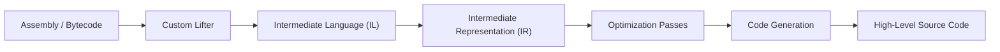

# Luramas

**Luramas** is a decompiler framework. 
It takes something hard to read, raw machine code or VM bytecode, and turns it back into readable, high-level source. 
The design is built around one idea: lift the target into an architecture-independent form once, then simplify that form over and over with small, provable optimizations until it looks like the code a person would have written.

That idea is what lets one pipeline use unrelated targets. 
x86-64, Lua, etc all lift into the same **IL**, and from there nothing downstream knows or cares which target it came from. 
Add a new front-end and the entire optimizer and every emitter come for free.

## Pipeline

A decompile runs through four stages, front to back:

1. **Lifting Assembly** - a per-target disassembler decodes bytes into structured instructions, and a lifter turns each instruction into **IL** with no meaning attached to the original opcode names. See **[Disassemblers](./Framework/Intermediate-Language/Lifting/disassemblers)** and **[Writing a Lifter](./Framework/Intermediate-Language/Lifting/writing-lifters)**.
2. **Intermediate Language (IL)** - the shared, architecture-independent instruction set. Every target uses it; see the **[IL Overview](./Framework/Intermediate-Language/il-overview)** and the **[Instruction Set Architecture](./Framework/Intermediate-Language/isa)**. The IL buffer is then bridged to a **[closure tree](./Framework/Intermediate-Language/closures)**.
3. **Intermediate Representation (IR)** - the closure is lifted into the `ir_stat` model, control flow is rebuilt, SSA is constructed, and a fixed schedule of passes simplifies everything. See **[Overview](./Framework/Intermediate-Representation/overview)**.
4. **Code Generation** - the optimized IR is emitted into a real high-level language through a per-language emitter. See **[Emitters](./Framework/Code-Generation/emitters)**.

## Where to start

* Want to build it? See **[Building Luramas](./Framework/building)**.
* Want to run a decompile end to end? See **[Usage](./Framework/usage)**.
* Want to contribute a patch? See **[Contributing](./contributing)**.
* Want the theory behind why it is built this way? The blog series walks through the whole design from scratch: https://pidova.github.io/blog/posts/chapter-0/
